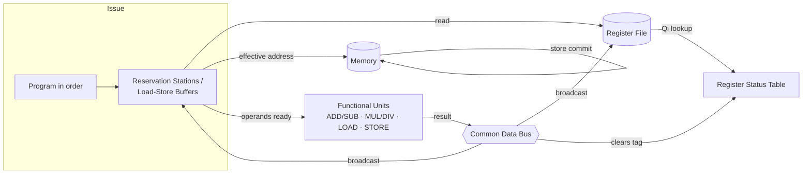

# Tomasulo Algorithm Simulator — Project Report

**Course:** Computer Organization
**Project:** Interactive Tomasulo's Algorithm Simulator (vanilla HTML/CSS/JS)

---

## 1. Introduction

Tomasulo's algorithm, introduced by Robert Tomasulo at IBM in 1967 for the
IBM 360/91 floating-point unit, is the foundational technique for **dynamic
instruction scheduling** in out-of-order processors. Its central insight is
that a processor does not need to execute instructions strictly in the order
they were fetched — it only needs to *look* as if it did, from the point of
view of correctness (data hazards resolved) and, in the classic in-order
commit variant, program order preserved for exceptions.

Static (compile-time) scheduling cannot react to hazards whose latency is
only known at run time (a cache miss, a variable-latency divide, etc.).
Tomasulo's algorithm solves this at the hardware level with three
cooperating mechanisms:

1. **Reservation stations** — small buffers attached to each functional
   unit that hold an instruction's opcode and its operands (or *tags*
   identifying which other reservation station will eventually produce a
   missing operand).
2. **Register renaming via a Register Status table** — instead of stalling
   on WAR/WAW hazards, every register write is given a new "name" (the
   reservation station that will produce it). Readers either get the
   current architectural value or the tag of whoever will produce the
   fresh value.
3. **A Common Data Bus (CDB)** — the single broadcast mechanism by which a
   finished instruction's result reaches every station and register still
   waiting for it, in the same cycle, without going through the register
   file first.

The result is that independent instructions overlap freely, RAW hazards are
satisfied the instant the value is available (not the instant the register
file is updated), and WAR/WAW hazards vanish entirely because a "stale"
reader already captured either the old value or a tag pointing at the
*correct* (older) producer at issue time.

This project implements the full algorithm — issue, execute, and write-back,
including CDB arbitration and register renaming — as a dependency-free
browser application, plus an automated test suite that checks the timing
invariants a grader would look for.

---

## 2. Internal Architecture

### 2.1 Components

| Component | Role |
|---|---|
| **Reservation Stations (Add/Sub, Mul/Div)** | Hold a busy arithmetic instruction's opcode, resolved/unresolved operands (`Vj`/`Vk`, `Qj`/`Qk`), and destination register. |
| **Load / Store Buffers** | Same idea specialized for memory: hold the *effective address* and, for stores, the value operand. |
| **Register Status Table (Qi)** | One entry per architectural register. `null` means "value is in the register file"; otherwise it names the station that will eventually produce it — this *is* register renaming. |
| **Register File** | The architectural F0–F10 values, plus fixed R1–R3 base registers used only for address arithmetic. |
| **Common Data Bus (CDB)** | The single broadcast path. Exactly one station may drive it per cycle; every other station whose `Qj`/`Qk` matches the broadcaster latches the value that same cycle. |
| **Memory** | A flat address→value map written by STORE and read by LOAD. |

### 2.2 Data flow



Every arrow into a reservation station from the CDB happens in the *same*
cycle the result is produced — this is what lets a dependent instruction
begin executing on the very next cycle instead of waiting for a separate
register-file write-then-read round trip.

### 2.3 Station fields (as implemented)

```
{
  name, kind, busy, op, instrId,
  Vj, Vk,        // resolved operand values
  Qj, Qk,        // station name producing an unresolved operand, else null
  A,             // effective address (LOAD/STORE)
  dest,          // destination register (null for STORE)
  execStarted, execStart, execEnd,
  result, writtenBack
}
```

---

## 3. Instruction Lifecycle

Every instruction passes through exactly three stages, each occupying one or
more clock cycles:

### Issue (1 cycle, in program order)
1. Look up a free station in the pool matching the opcode (Add/Sub, Mul/Div,
   Load, or Store). If none is free, **stall** — issue does not advance
   until next cycle (structural hazard).
2. For each source register, consult the Register Status table:
   - If it is `null`, copy the current value into `Vj`/`Vk` (operand ready).
   - Otherwise copy the *producing station's name* into `Qj`/`Qk` (operand
     pending — this is the renaming step that defeats WAR/WAW).
3. For LOAD/STORE, compute the effective address immediately
   (`base register value + offset`) — base registers are fixed and never
   renamed, matching the classic textbook simplification.
4. Point the Register Status table's destination entry at this station
   (for LOAD/arithmetic; STORE has no destination register).

### Execute (`latency` cycles)
Begins the first cycle *after* both operands are ready (never the same
cycle a value arrives on the CDB — see the timing note below) and runs for
the opcode's configured latency. LOAD reads memory at the start of
execution; STORE cannot begin until its value operand is ready.

### Write Result (1 cycle, via the CDB — except STORE)
Once execution finishes, the result is a candidate to use the CDB. If more
than one instruction finishes in the same cycle, **only the one issued
earliest (lowest program-order id) wins**; the rest wait and retry next
cycle. The winner:
- Broadcasts its value to every station whose `Qj`/`Qk` names it (same
  cycle forwarding).
- Updates the Register Status table **only if it is still the most recent
  writer** of its destination (this is the WAW-out-of-order-completion
  guard — see §4).
- Frees its station.

STORE never touches the CDB (it has no register destination); once its
value operand is ready and its execute stage finishes, it commits directly
to memory the following cycle with no arbitration needed.

### Timing convention actually implemented

A value broadcast on the CDB during cycle *N* is visible to *all* waiting
stations starting cycle *N*, but none of them may **begin executing** until
cycle *N+1* — matching the standard textbook convention that issue→execute
and execute→write-back are each separated by at least one full cycle. This
is why every test asserts `execStartCycle > issueCycle` and
`writeCycle > execEndCycle` strictly.

---

## 4. Design Decisions & Assumptions

- **Latencies** default to the widely used teaching values: ADD/SUB = 2,
  MUL = 4, DIV = 8, LOAD/STORE = 2 cycles — all editable from the UI.
- **Base registers (R1–R3)** are treated as fixed integer constants, not
  renamed. This is the standard simplification used in the Hennessy &
  Patterson textbook examples this simulator's first preset is drawn from,
  and keeps the project focused on floating-point register renaming, which
  is the actual subject of Tomasulo's algorithm.
- **Memory** is a simple sparse address→value map rather than a byte-array,
  since the algorithm's behavior does not depend on memory layout.
- **CDB arbitration by program order**: when two results are ready the same
  cycle, the instruction issued earlier wins. This is a common, defensible
  policy (others, like round-robin, are equally valid); it is documented
  here specifically because the spec requires *some* deterministic
  arbitration rule.
- **WAW out-of-order completion correctness**: because reservation stations
  can finish in *any* order, it is possible for a newer instruction
  targeting the same register to write back *before* an older, slower one
  finishes. The Register Status table's "most recent writer" tag is the
  single source of truth used to decide whether a write-back is still
  allowed to touch the register file — an older write-back whose tag has
  since been overwritten is discarded rather than clobbering the newer
  value. This exact scenario is covered by an automated test
  (`tests/simulator.test.js`, *"WAW: ... register file keeps the
  program-order-correct (newer) value"*).
- **No memory disambiguation**: loads and stores are not checked against
  each other's addresses (no store-to-load forwarding or hazard detection
  across memory buffers). This is a common simplification in teaching
  simulators; real Tomasulo-style machines add an explicit memory
  disambiguation unit for this, which is out of scope here.
- **Structural hazards** are real: reducing a station pool's count in the
  configuration editor can and does delay issue of later instructions,
  exactly as on real hardware.

---

## 5. Worked Example

This is the simulator's first preset, **"Classic Hazard Demo"** — the
canonical Hennessy & Patterson example, chosen specifically because F6 and
F2 are each targeted twice, forcing WAR/WAW hazards that must be resolved
purely through renaming.

**Program** (with this project's default configuration: 3 Add/Sub, 2
Mul/Div, 3 Load, 3 Store stations; ADD/SUB=2, MUL=4, DIV=8, LOAD/STORE=2
cycle latencies; F4 = 5 initially; `mem[134] = 12.5`, `mem[245] = 7.5`):

```
1  LOAD F6, 34(R2)      ; F6 <- mem[100+34]  = mem[134] = 12.5
2  LOAD F2, 45(R3)      ; F2 <- mem[200+45]  = mem[245] = 7.5
3  MUL  F0, F2, F4      ; F0 <- F2 * F4
4  SUB  F8, F6, F2      ; F8 <- F6 - F2   (reads the ORIGINAL F6)
5  DIV  F10, F0, F6     ; F10 <- F0 / F6  (also reads the ORIGINAL F6)
6  ADD  F6, F8, F2      ; F6 <- F8 + F2   (overwrites F6 — WAW/WAR target)
```

**Actual simulator output** (from `docs/REPORT.md` generation run — every
number below was produced by the engine itself, not hand-computed):

| # | Instruction | Issue | Exec Start | Exec End | Write | Result |
|---|---|---|---|---|---|---|
| 1 | `LOAD F6, 34(R2)` | 1 | 2 | 3 | 4 | 12.5 |
| 2 | `LOAD F2, 45(R3)` | 2 | 3 | 4 | 5 | 7.5 |
| 3 | `MUL F0, F2, F4` | 3 | 6 | 9 | 10 | 37.5 |
| 4 | `SUB F8, F6, F2` | 4 | 6 | 7 | 8 | 5 |
| 5 | `DIV F10, F0, F6` | 5 | 11 | 18 | 19 | 3 |
| 6 | `ADD F6, F8, F2` | 6 | 9 | 10 | 11 | 12.5 |

**CDB broadcast log:**

| Cycle | Station | Dest | Value |
|---|---|---|---|
| 4 | Load1 | F6 | 12.5 |
| 5 | Load2 | F2 | 7.5 |
| 8 | Add1 | F8 | 5 |
| 10 | Mul1 | F0 | 37.5 |
| 11 | Add2 | F6 | 12.5 |
| 19 | Mul2 | F10 | 3 |

Total: **19 cycles**. Final register file: `F0=37.5, F2=7.5, F4=5, F6=12.5,
F8=5, F10=3` — matching hand computation exactly
(`F0 = 7.5×5`, `F8 = 12.5−7.5`, `F10 = 37.5÷12.5`, `F6(new) = 5+7.5`).

### Why instructions overlap

- **MUL (#3) and SUB (#4) both start executing on cycle 6.** MUL needed F2
  (from LOAD #2, which only broadcasts on cycle 5) and F4 (already in the
  register file). SUB needed F6 (from LOAD #1, broadcast cycle 4) and F2
  (broadcast cycle 5). Both instructions' last outstanding operand resolves
  during cycle 5, so both become executable starting cycle 6 — and because
  they use *different* functional-unit pools (Mul/Div vs. Add/Sub), there is
  no structural conflict and they genuinely run in parallel for cycles 6–7.
- **The two LOADs overlap cycles 2–4** in the same way: LOAD #2 issues on
  cycle 2 while LOAD #1 is still executing, and since there are 3 load
  buffers available, it doesn't have to wait for a free station.
- **DIV (#5) is the long pole.** It cannot start until F0 is ready (cycle
  10's broadcast from MUL), so it doesn't begin executing until cycle 11,
  and — being latency 8 — doesn't finish until cycle 18, holding up the
  whole program's completion until cycle 19. This is exactly the kind of
  critical-path behavior Tomasulo's algorithm is meant to expose and
  minimize: everything *not* on DIV's dependency chain finishes by cycle
  11, ten cycles earlier.
- **The WAW/WAR hazard on F6 is resolved with zero stalling.** SUB (#4) and
  DIV (#5) both captured `Qj`/value for F6 at *issue* time — before ADD (#6)
  ever issued — so they see the original loaded value (12.5) regardless of
  when ADD eventually overwrites F6. ADD (#6), issued after SUB and DIV,
  correctly becomes the new tag owner of F6 in the Register Status table,
  and its own write-back at cycle 11 is what finally updates the
  architectural F6 value. No instruction had to stall to make this correct.

---

## 6. User Interface

The UI uses a dark "engineering blueprint" theme (subtle grid backdrop,
monospace data font, cyan/amber/blue signal-color coding) and is laid out
as:

- **Header** — project title and a large, glowing cycle counter.
- **Controls bar** — Step, Run (adjustable speed 1–10), Pause, Reset, and a
  preset picker, plus a status pill (Ready / Running / Done in N cycles).
- **Left column** — the Program Editor (per-row opcode/register dropdowns,
  add/remove instructions) and the Configuration Editor (station counts,
  latencies, initial register values, initial memory cells).
- **Right column** — the live SVG datapath schematic (reservation
  stations, load/store buffers, the CDB bus line, register file and
  memory boxes; a small pulse travels along the bus on every broadcast),
  followed by the Instruction Status table, Add/Sub and Mul/Div
  reservation-station tables side by side, Load/Store buffer tables side
  by side, and finally the Register Status/Values table alongside the CDB
  broadcast log.

Every busy row across all tables is color-coded by the same signal system
used in the schematic: **blue** = waiting on an operand, **amber** =
executing, **cyan** = broadcasting on the CDB this cycle — so a user can
correlate the diagram and the raw tables at a glance. The layout collapses
to a single column below ~1080px width, and all interactive elements have
visible focus outlines.

---

## 7. How to Run

No build step, no installation:

1. Open `index.html` directly in any modern browser (double-click it, or
   serve the folder with any static file server if your browser blocks
   `file://` ES module imports — e.g. `python -m http.server` from the
   project root, then visit `http://localhost:8000/`).
2. Pick a preset (or edit the program/configuration yourself), then use
   **Step** / **Run** / **Pause** / **Reset**.

To run the automated test suite (Node.js ≥ 18):

```
cd tomasulo-simulator
node --test tests/
```

or, with the provided `package.json` script:

```
npm test
```

All 16 tests — covering real arithmetic correctness, LOAD/STORE against the
memory model, WAR/WAW hazard resolution (including the out-of-order
write-back edge case), structural hazards, CDB single-writer arbitration,
and the strict issue→execute→write ordering — pass.
